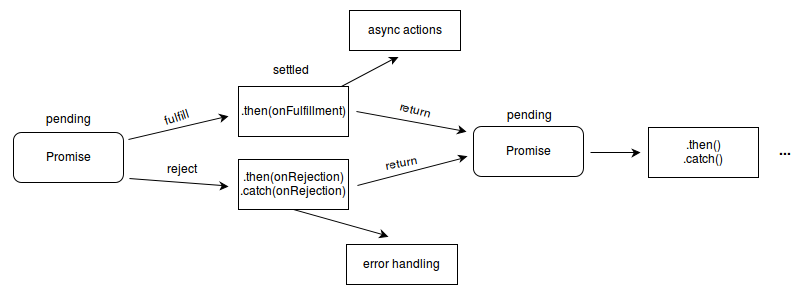

# Промисы

**Промис** — это объект, представляющий асинхронную операцию, выполненную удачно или неудачно. По сути, это способ браузера сказать: "я обещаю вернуться к вам с ответом как можно скорее", поэтому в дословном переводе "промис" (promise) означает "обещание".

Промисы позволяют обрабатывать результаты асинхронных операций так, как если бы они были синхронными.

В промис передается коллбэк, которую называют исполнитель (`executor function`). Исполнитель вызывается сразу, еще до того, как конструктор вернет созданный объект, т. е. код в этом коллбэке выполняется синхронно. Пример:

```jsx
new Promise(() => {
    console.log('Promise callback executed!')
})

console.log('Hi!')

// Вывод:
// Promise callback executed!
// Hi!
```

Хотя обычно в промисе запускаются какие-то асинронные операции, нужно иметь это в виду.

Коллбэк, передаваемый в промис принимает в качестве параметров две функции:

* `resolve` - вызывается в случае успешного завершения
* `reject` - вызывается в случае ошибки

В эти коллбэки можно передать параметры: в `resolve` - данные для коллбэка, которые будут вызваны в случае успеха, в `reject` - ошибку для обработчика ошибок.

Возвращаемое значение коллбэка, который передается в промис, игнорируется.

У объекта промиса есть три метода, которые принимают коллбэки:

* `then` - принимает два коллбэка - `onFullfilled`, который будет вызван в случае успеха и `onRejected`, который будет вызван в случае ошибки.
* `catch` - будет вызыван в случае ошибки. Аналогичен вызову `then`, где в качестве первого параметра передан `undefined`.
* `finally` - будет вызван при завершении промиса, как в случае успеха, так и в случае ошибки

Сами эти методы также возвращают промисы, что позволяет создавать цепочку вызовов:

```jsx
function error(err) {
  console.log('Error: ', err);
}

Promise.reject('Oops!')
 .then(success, error);
// Logs 'Error: Oops!'
Promise.reject('Oops!')
 .then(success)
 .catch(error);
// Logs 'Error: Oops!'
```

Разница между использованием `then` с двумя параметрами и `catch` в том, что в первом случае, если `then` вернет отклоненный промис, то он никак не будет обработан, в отличие от второго ([ссылка](https://dmitripavlutin.com/javascript-promises-then-vs-then-catch/)):

```jsx
function rejectSuccess(invalidValue) {
  console.log('Invalid success: ', invalidValue);
  return Promise.reject('Invalid!');
}

Promise.resolve('Zzz!')
 .then(rejectSuccess, error);
// Logs 'Invalid success: Zzzzz!'
Promise.resolve('Zzz!')
 .then(rejectSuccess)
 .catch(error);
// Logs 'Invalid success: Zzzzz!'
// Logs 'Error: Invalid!'
```

Промис может находиться в трёх состояниях:

* _ожидание (_`pending`_)_: начальное состояние, не исполнен и не отклонён.
* _исполнено (_`fulfilled`_)_: операция завершена успешно.
* _отклонено (_`rejected`_)_: операция завершена с ошибкой

Говорят, что промис находится в состоянии _`settled` (завершен), когда он либо исполнен, либо отклонен_, т. е. не находится в состоянии ожидания*.

\* Это лишь форма речи, не являющаяся настоящим состоянием промиса.

Методы `then` и `catch` в свою очередь сами возвращают промис, что позволяет создавать цепочки вызовов.



`try/catch` не будет работать с промисами, т. е. ошибка выброшенна в промисе, полученном в секции `try` не будет перехвачена и вообще выброшена наружу. Для этого необходимо использовать метод `catch` промиса.

## Методы

`Promise.resolve` - возвращает выполненный промис с указанным значением. В качестве параметра можно передать какое-нибудь значение, промис или `thenable`-объект (объект, у которого есть метод `then`).

`Promise.reject` - возвращает промис, отклоненный по указанной в качестве первого аргумента причине.

`Promise.all` **-** принимает итерируемый объект (`iterable`) из промисов. Возвращает промис, который будет либо исполнен, если все промисы будут исполнены, либо отклонен, если хотя бы один из промисов был отклонен. В обработчик будет передан результат выполнения всех промисов с соблюдением их порядка в массиве.

`Promise.any` **-** принимает итерируемый объект (`iterable`) из промисов. Если хотя бы один из промисов выполнится успешно, метод возвратит единственный объект `Promise` со значением выполненного промиса. Если ни один из промисов не завершится успешно (если все промисы завершатся с ошибкой, т.е. `rejected`), тогда возвращённый объект Promise будет отклонён (`rejected`) с одним из значений: массив содержащий причины ошибки (отклонения), или `AggregateError` - подкласс `Error`, который объединяет выброшенные ошибки вместе. По существу, метод `Promise.any()` является противоположностью для `Promise.all()`. Пу сути является противоположностью метода `Promise.all`.

`Promise.allSettled` **-** принимает итерируемый объект (`iterable`) из промисов и ожидает, пока все они будут завершены (исполнены или отклонены). В обработчик будет передан результат выполнения всех промисов с соблюдением их порядка в массиве. Результат каждого промиса - объект с полями `status` (`fullfilled` или `rejected`), в зависимости от результата, `value`, либо `reason`.

`Promise.race` **-** принимает итерируемый объект (`iterable`) из промисов и возвращает промис, который будет `resolved` или `rejected` в зависимости от результата первого завершенного (`settled`) промиса.
