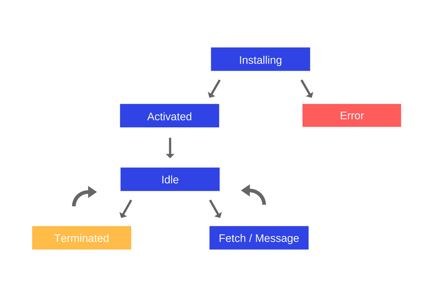

# Воркеры

В JavaScript есть **основной поток**, в котором выполняется весь код. Для параллельного выполнения кода в отдельных потоках в JavaScript появились **веб-воркеры**.

* Основной потом и воркеры полностью изолированы и не имеют доступа к переменным друг друга. Это позволяет избегать конфликтов параллельного доступа к общим ресурсам, как, например, race condition.
* Воркеры не имеют доступа к DOM — не получится использовать воркер для обновления UI, он может только обработать большой объем данных.
* Главный потом и воркеры общаются между собой с помощью сообщений.

Есть три типа воркеров:

* dedicated
* shared
* service

Пример:

```jsx
// в главном потоке
const worker = new Worker('./generate.js')

worker.postMessage({
    command: 'generate',
    quota: quota
})

worker.addEventListener('message', message => {
    console.log(message)
})

// в воркере
addEventListener('message', message => {
    console.log(message.data)
})

postMessage('Hi!')
postMessage({
    result: 123,
})
```

Сигнатура `postMessage`:

```jsx
postMessage(message, targetOrigin)
postMessage(message, targetOrigin, [transfer])
```

[postMessage (MDN)](https://developer.mozilla.org/en-US/docs/Web/API/Window/postMessage)

## Shared Workers

Shared-воркеры отличаются от обычных тем, что к ним могут обращаться сразу несколько документов.

С их помощью можно организовать коммуникацию между несколькими окнами.

```jsx
const worker = new SharedWorker('worker.js')
```

У shared-воркера есть свойство `port`, которое представляет собой инстанс объекта `MessagePort`:

```jsx
worker.port.start()

worker.port.postMessage([first.value,second.value])

myWorker.port.onmessage = function(e) {
    console.log(e.data)
}
```

Внутри воркера:

```jsx
onconnect = function(e) {
  var port = e.ports[0];

  port.addEventListener('message', function(e) {
    var workerResult = 'Result: ' + (e.data[0] * e.data[1]);
    port.postMessage(workerResult);
  });

  port.start(); // Required when using addEventListener. Otherwise called implicitly by onmessage setter.
}
```

## Service Workers

Сервис-воркеры позволяют перехватывать запросы к серверу и обрабатывать их. Таким образом, например, можно организовать кеширование данных на уровне сервис-воркера.

Также из сервис-воркеров можно отправлять пуш-уведомления.

Сначала необходимо зарегистрировать сервис-воркер с помощью метода `register` объекта `navigator.serviceWorker`:

```jsx
if ('serviceWorker' in navigator) {
    // Supported!
    navigator.serviceWorker.register('/sw.js', options)
        .then(function(serviceWorkerRegistration)
}
```

При регистрации указывается путь у файлу с сервис-воркером и возвращается промис.

Жизненный цикл сервис-воркера:



В случае успешной установки, в сервис-воркере срабатывает событие `install`:

```jsx
self.addEventListener('install', event => {
    //
})
```

Также у сервис воркера есть события `activate`, `idle`, `fetch`.

```jsx
self.addEventListener('fetch', event => {
    // в метод respond with можно передать значение или промис
    event.respondWith(...)
})
```

У серсис-воркеров есть API для кеширования - `CacheStorage`, которое доступно под названием `caches`.

### Стратегии кеширования

* Cache only
* Network only
* Cache falling back to network
* Network falling back to cache
* Generic fallback

[Understanding Service Workers and Caching Strategies](https://blog.bitsrc.io/understanding-service-workers-and-caching-strategies-a6c1e1cbde03)
